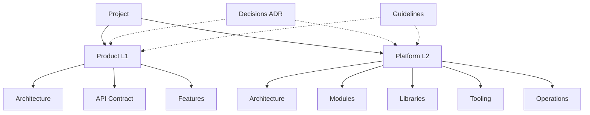

# Project Documentation

This directory contains the technical documentation for the project.

The repository consists of two primary layers:
- **Product (L1)** – the business application and its components.
- **Platform (L2)** – the engineering platform that provides the developer workspace, runtime environments, CI/CD, and automation required to build and run the product.

The documentation is organized to reflect this separation.

---

## How to Use This Documentation
| Goal | Start Here |
|-----|------------|
| Understand the system architecture | `docs/product/architecture/` |
| Work on the application features | `docs/product/features/` |
| Modify infrastructure or tooling | `docs/platform/modules/` |
| Understand how the system runs | `docs/platform/operations/` |
| Understand why decisions were made | `docs/decisions/` cross-cutting across product and platform |
| Follow development standards | `docs/guidelines/` cross-cutting across product and platform |

Architecture and platform documents describe the **current state of the system**.
Historical reasoning and architectural evolution are recorded in `docs/decisions/` using ADRs.

---

## ToC
1. [Documentation Structure](#documentation-structure)
2. [Product (L1)](#product)
3. [Platform (L2)](#platform)
4. [Decisions](#decisions)
5. [Guidelines](#guidelines)

<h2 id="documentation-structure">1. Documentation Structure</h2>

The documentation is organized into the following main sections:
- **Product (L1)**: Documentation of business app
- **Platform (L2)**: Documentation of engineering platform
- **Decisions**: Architectural Decision Records (ADRs) `cross-cutting` across product and platform
- **Guidelines**: General technical guidelines `cross-cutting` across product and platform

---

**Visual Representation**

---

<h3 id="product">2. Product (L1)</h3>

`docs/product/`  
Documentation related to the business application itself.

Includes:
- system architecture
- API contract
- feature documentation

Structure:

- **architecture/**
    - 👉 [`context.md`](/docs/product/architecture/context.md) - system context and external dependencies
    - 👉 [`containers.md`](/docs/product/architecture/containers.md) - major application components
    - 👉 [`deployment.md`](/docs/product/architecture/deployment.md) - how the product is deployed
- 👉 [`api-contract.md`](/docs/product/api-contract.md) - Human readable documentation of the API contract
- 👉 [`api-contract.openapi.json`](/docs/product/api-contract.openapi.json) - Machine readable API specification.
- **features**
    - 👉 [`api.md`](/docs/product/features/api.md) - API related features
    - 👉 [`auth.md`](/docs/product/features/auth.md) - Authentication and authorization features
    - 👉 [`frontend.md`](/docs/product/features/frontend.md) - Frontend related features

These documents describe feature-level behaviour and responsibilities.

<h3 id="platform">3. Platform (L2)</h3>

`docs/platform/`  
Documentation related to the engineering platform that supports development, testing and deployment of the product.

This layer provides:

- local development workspace
- environment configuration
- container orchestration
- CI/CD pipelines
- automation scripts

Structure:

- **`architecture/`**
    - 👉 [`workspace.md`](/docs/platform/architecture/workspace.md) - Local development workspace architecture and setup
    - 👉 [`ci-cd.md`](/docs/platform/architecture/ci-cd.md) - CI/CD architecture and pipeline definitions
    - 👉 [`environments.md`](/docs/platform/architecture/environments.md) - Runtime environment architecture and configuration
    - 👉 [`secrets.md`](/docs/platform/architecture/secrets.md) - Secrets management architecture and configuration
- **`modules/`**
    - 👉 [`bootstrap.md`](/docs/platform/modules/bootstrap.md) - Bootstrapping the platform
    - 👉 [`local-dev.md`](/docs/platform/modules/local-dev.md) - Local development module details
    - 👉 [`runtime-orchestration.md`](/docs/platform/modules/runtime-orchestration.md) - Runtime orchestration module details
    - 👉 [`github-ci.md`](/docs/platform/modules/github-ci.md) - GitHub-related module details
    - 👉 [`githooks.md`](/docs/platform/modules/githooks.md) - Git hooks module details
    - 👉 [`scripts.md`](/docs/platform/modules/scripts.md) - Automation scripts details    
- **`libraries/`**
    - 👉 [`scripts-runtime.md`](/docs/platform/libraries/scripts-runtime.md) - Library for executing automation scripts
    - 👉 [`logging.md`](/docs/platform/libraries/logging.md) - Logging library for platform modules and scripts
    - 👉 [`config.md`](/docs/platform/libraries/config.md) - Configuration management library for platform modules and scripts

- **`tooling/`**
    - 👉 [`github-copilot.md`](/docs/platform/tooling/github-copilot.md) - GitHub Copilot configuration and usage guide
    - 👉 [`vscode-copilot.md`](/docs/platform/tooling/vscode-copilot.md) - VSCode Copilot configuration and usage guide
- **`operations/`**
    - 👉 [`local-development.md`](/docs/platform/operations/local-development.md) - Guide for local development workflow
    - 👉 [`ci.md`](/docs/platform/operations/ci.md) - Guide for CI pipeline execution and troubleshooting
    - 👉 [`deployment.md`](/docs/platform/operations/deployment.md) - Guide for deployment process and troubleshooting

<h3 id="decisions">4. Decisions</h3>

`docs/decisions/`  
Architectural Decision Records (ADRs) documenting key architectural decisions made during the project.  

Structure:

- 👉 [`ADR-001-Monorepo-structure.md`](/docs/decisions/ADR-001-Monorepo-structure.md) - Decision on using a monorepo structure for the project
- 👉 [`ADR-002-Secrets-Management.md`](/docs/decisions/ADR-002-Secrets-Management.md) - Decision on managing secrets within the project
- 👉 [`ADR-003-Docker-Orchestration-Strategy.md`](/docs/decisions/ADR-003-Docker-Orchestration-Strategy.md) - Decision on the strategy for Docker orchestration
- 👉 [`ADR-004-Environment-Configuration-Strategy.md`](/docs/decisions/ADR-004-Environment-Configuration-Strategy.md) - Decision on the strategy for environment configuration
- 👉 [`ADR-005-Local-Development-Workflow.md`](/docs/decisions/ADR-005-Local-Development-Workflow.md) - Decision on the local development workflow
- 👉 [`ADR-006-CI-Validation-Strategy.md`](/docs/decisions/ADR-006-CI-Validation-Strategy.md) - Decision on the strategy for CI validation
- 👉 [`ADR-007-API-Contract-Management.md`](/docs/decisions/ADR-007-API-Contract-Management.md) - Decision on the strategy for API contract management

<h3 id="guidelines">5. Guidelines</h3>

`docs/guidelines/`  
General technical guidelines and best practices for the project.    

Structure:

- 👉 [`technical-design-setup.md`](/docs/guidelines/technical-design-setup.md) - Guidelines for setting up technical design documents
- 👉 [`coding-standards.md`](/docs/guidelines/coding-standards.md) - Guidelines for coding standards and best practices     
