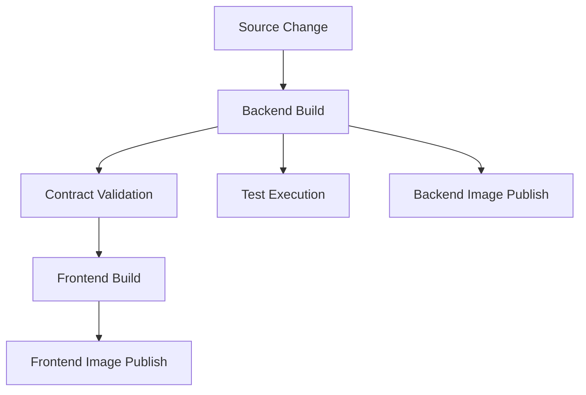

# Platform Architecture: CI/CD

## Overview

The platform uses GitHub Actions as the CI/CD orchestration layer for repository validation and artifact production. The pipeline coordinates backend and frontend build flows, validates the API contract, runs automated checks, and publishes container images.

Architecture documentation in this section describes the pipeline structure and responsibilities. Exact job steps, commands, tags, and scripts remain defined in the workflow files and scripts.

## Responsibilities

The CI/CD architecture is responsible for:

- building the backend and frontend deliverables
- validating that the backend contract remains aligned with the documented API contract
- running automated verification before publishable outputs are produced
- publishing container images for downstream runtime environments

## Pipeline Shape

The current pipeline is organized as a staged flow with shared outputs from the backend build and a separate frontend path.

## Architectural Boundaries

- **GitHub Actions** is the orchestration boundary for CI/CD execution.
- **Repository code and scripts** define the concrete build and validation logic.
- **Artifacts** bridge pipeline stages so later stages do not need to rebuild from scratch.
- **Container registry publishing** is the handoff from CI into runtime and deployment concerns.

## Invariants

The pipeline is structured around a few stable rules:

- backend build output is a prerequisite for multiple downstream checks and publish steps
- API contract validation happens before the frontend publish flow completes
- publishable container images are produced by CI rather than manually assembled in runtime environments
- credentialed registry access is separated from build logic and provided through secret injection

## How It Fits Together

The CI/CD architecture connects several platform concerns:

- it consumes application code from the monorepo
- it uses documentation artifacts as part of validation, especially for API contract checks
- it produces images that runtime environments consume through Docker Compose configuration
- it depends on the platform secrets model for authenticated publishing

## Related Files

- Workflow definition: [.github/workflows/ci.yml](/home/devon90/Desktop/engineering-foundation/.github/workflows/ci.yml)
- Contract validation script: [scripts/ci/api-diff-ci.sh](/home/devon90/Desktop/engineering-foundation/scripts/ci/api-diff-ci.sh)
- Backend image build context: [apps/api/Dockerfile](/home/devon90/Desktop/engineering-foundation/apps/api/Dockerfile)
- Frontend image build context: [apps/frontend/app/Dockerfile](/home/devon90/Desktop/engineering-foundation/apps/frontend/app/Dockerfile)