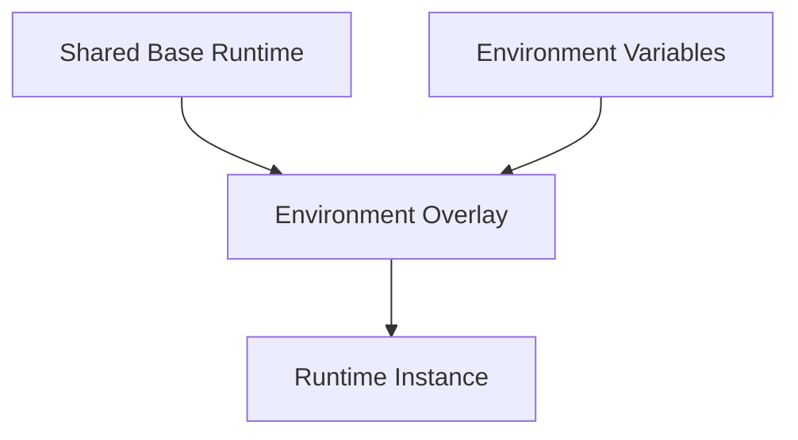

# Platform Architecture: Environments

## Overview

The platform separates runtime concerns by environment rather than by duplicating the entire stack for each use case. A shared base defines common services, while environment-specific overlays supply configuration differences needed for development and future runtime targets.

This document describes the configuration model. Exact compose definitions, variable names, and deployment commands remain in the runtime files and scripts.

## Architectural Model

The current environment architecture has three layers:

- a **shared base runtime** that defines the common service topology
- **environment overlays** that adapt the base for a particular context
- **environment variable files** that inject environment-specific values into runtime configuration

## Responsibilities

The environments architecture is responsible for:

- keeping common runtime structure in one place
- isolating environment-specific configuration from shared service definitions
- allowing CI-produced images to be selected by configuration rather than by editing compose files
- preserving a consistent runtime shape across local and non-local environments

## Current Boundaries

- **Base runtime** lives under the shared runtime configuration and defines the common service set.
- **Environment overlays** extend or refine the base for a specific environment.
- **Environment variable files** provide runtime values such as image selection and service configuration.
- **CI/CD** produces deployable images, while environment configuration decides which image version is consumed.

## Current State

The repository currently models:

- a shared base runtime
- a development-specific overlay
- an environment variable directory with per-environment files and templates
- reserved directories for additional environments

This means the architecture already separates common runtime concerns from environment-specific concerns even though not every target environment is implemented yet.

## Invariants

The environment model is built around these stable rules:

- shared service topology should not be redefined separately for each environment
- environment differences should be expressed through overlays and injected configuration
- runtime image selection should come from configuration, not source changes
- environment configuration and runtime orchestration remain separate from CI workflow definitions

## How It Fits Together

The environments architecture links platform concerns in the following way:

- CI/CD produces versioned images
- environment configuration selects and configures those images
- runtime orchestration composes services into runnable environments
- secrets management provides sensitive values needed by specific environments

## Related Files

- Shared runtime base: [infra/runtime/base/docker-compose.base.yml](/home/devon90/Desktop/engineering-foundation/infra/runtime/base/docker-compose.base.yml)
- Development overlay: [infra/runtime/dev/docker-compose.dev.yml](/home/devon90/Desktop/engineering-foundation/infra/runtime/dev/docker-compose.dev.yml)
- Environment variables: [infra/runtime/env](/home/devon90/Desktop/engineering-foundation/infra/runtime/env)
- Architecture decision: [docs/decisions/ADR-004-Environment-Configuration-Strategy.md](/home/devon90/Desktop/engineering-foundation/docs/decisions/ADR-004-Environment-Configuration-Strategy.md)