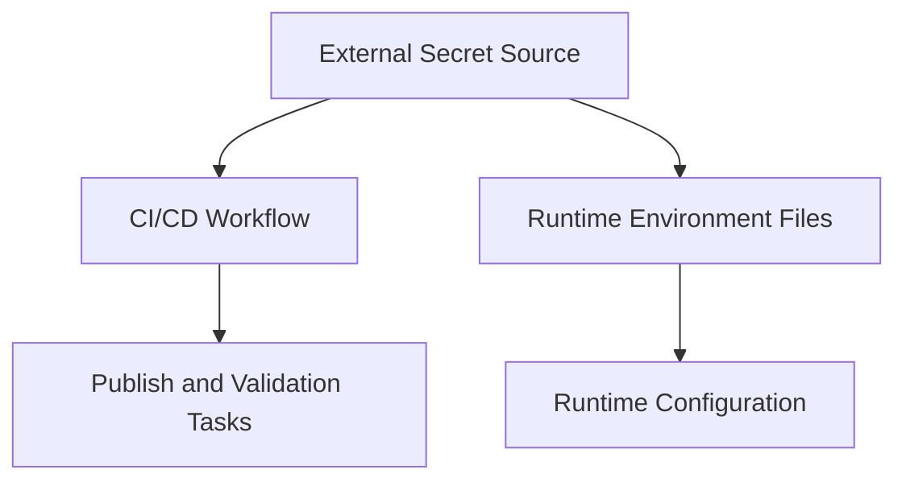

# Platform Architecture: Secrets Management

## Overview

The platform separates secret handling by execution context.

- **CI/CD secrets** are injected by the automation platform at workflow runtime.
- **Runtime and local secrets** are provided through environment files consumed by the runtime configuration.

This keeps sensitive values outside the repository while allowing both automated publishing and environment-specific runtime configuration.

## Architectural Model

Secrets are not part of source-controlled application configuration. Instead, they are supplied from external secret sources into the parts of the platform that need them.

## Responsibilities

The secrets architecture is responsible for:

- keeping credentials out of source-controlled code and documentation
- separating CI/CD credential injection from runtime configuration injection
- allowing different environments to carry different sensitive values without changing application code
- supporting authenticated external interactions such as registry access

## Current Boundaries

- **GitHub Actions secrets** provide sensitive values required during workflow execution.
- **Environment files** provide sensitive runtime values to local or deployed environments.
- **Templates** may exist in the repository to describe expected configuration shape, but real secret values do not.
- **Git ignore rules** protect environment files from accidental commit.

## Invariants

The current model is built around these stable rules:

- secrets are injected at execution time rather than stored in code
- CI/CD secrets and runtime secrets are handled through different delivery paths
- runtime configuration can vary by environment without changing the repository content
- secret-bearing files are excluded from version control while template files can remain versioned

## How It Fits Together

The secrets architecture connects to the rest of the platform in two ways:

- CI/CD depends on injected secrets for authenticated publishing and other protected workflow actions
- runtime environments depend on injected secrets through environment configuration consumed by Docker Compose and related scripts

## Related Files

- CI workflow: [.github/workflows/ci.yml](/home/devon90/Desktop/engineering-foundation/.github/workflows/ci.yml)
- Environment variable directory: [infra/runtime/env](/home/devon90/Desktop/engineering-foundation/infra/runtime/env)
- Ignore rules: [.gitignore](/home/devon90/Desktop/engineering-foundation/.gitignore)
- Architecture decision: [docs/decisions/ADR-002-Secrets-Management.md](/home/devon90/Desktop/engineering-foundation/docs/decisions/ADR-002-Secrets-Management.md)