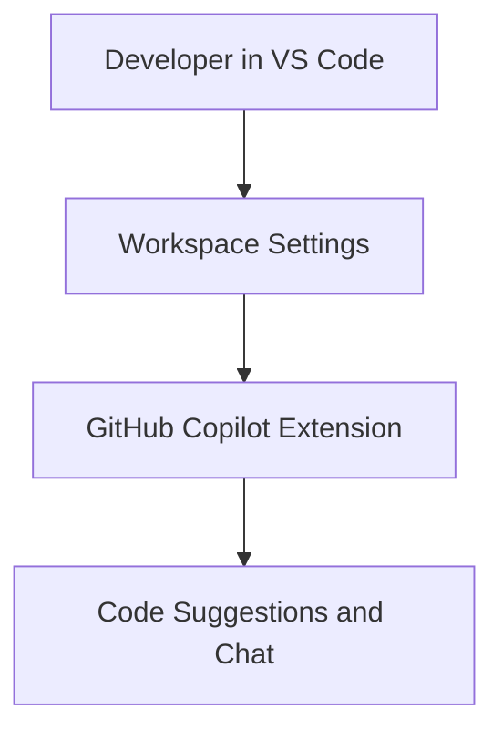

# Platform Tooling: GitHub Copilot

## Overview

GitHub Copilot is available to developers through the VS Code workspace configuration in this repository.

This document records the current, committed Copilot setup only.

## Architectural Model

## Responsibilities

Current Copilot tooling responsibilities are:

- provide AI-assisted coding and chat in the editor
- use shared workspace settings so behavior is consistent across developers
- remain non-blocking for build and runtime workflows

## Current Boundaries

- Copilot is enabled through `.vscode/settings.json`.
- The repository does not currently define team-level instruction files for Copilot behavior.
- Copilot is not part of CI enforcement; CI runs independently via GitHub Actions.

## Current State

Implemented today:

- workspace-level Copilot enablement in VS Code

Not implemented yet:

- repository-scoped Copilot instruction contracts
- project-specific Copilot policy files
- CI checks tied to Copilot usage or prompts

## Invariants

- Copilot is an assistive tool; repository code and tests remain the source of truth.
- Build, test, and deployment validation are performed by scripts and CI, not by Copilot output.

## Related Files

- VS Code workspace settings: [.vscode/settings.json](/home/devon90/Desktop/engineering-foundation/.vscode/settings.json)
- CI workflow (independent of Copilot): [.github/workflows/ci.yml](/home/devon90/Desktop/engineering-foundation/.github/workflows/ci.yml)
- Tooling index: [docs/README.md](/home/devon90/Desktop/engineering-foundation/docs/README.md)