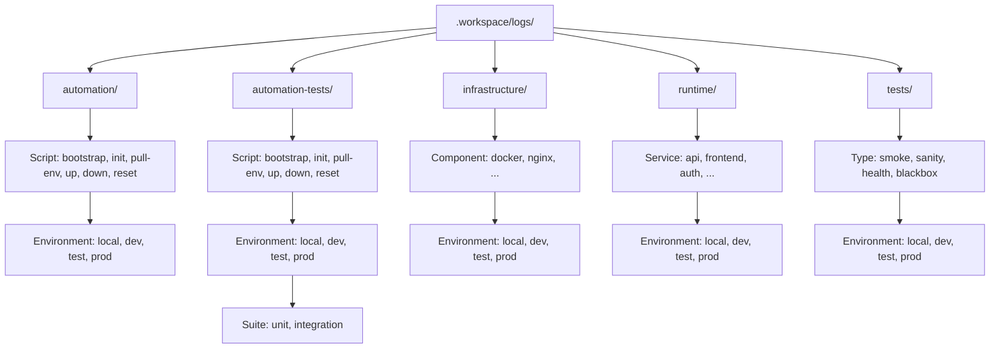

# Workspace Logs Structure

`.workspace/` contains artifacts generated by the engineering workspace.
This includes logs, temporary files, runtime metadata, and cached artifacts.

This document describes the structure of the `logs/` directory.

## Hierarchy

```
.workspace/                                                           # Developer workspace artifacts (NOT committed to Git)
│                                                                     # Contains runtime data generated by scripts, infra and tests
│
├── logs/                                                             # All logs produced by the engineering workspace
│
│   ├── automation/                                                   # Runtime execution logs from automation scripts
│   │
│   │   ├── bootstrap/                                                # Repository bootstrap process
│   │   │   ├── local/
│   │   │   │   └── bootstrap-2026-02-25T08-52-55+0100.log
│   │   │   ├── dev/
│   │   │   └── test/
│   │   │
│   │   ├── init/                                                     # Repository initialization scripts
│   │   ├── pull-env/                                                 # Environment configuration fetch/update
│   │   ├── up/                                                       # Environment startup scripts
│   │   ├── down/                                                     # Environment shutdown scripts
│   │   ├── reset/                                                    # Environment reset scripts
│   │   └── ...
│
│   ├── automation-tests/                                             # Tests for automation script code quality
│   │
│   │   ├── bootstrap/                                                # Bootstrap script tests
│   │   │   ├── local/
│   │   │   │   ├── unit/
│   │   │   │   │   └── bootstrap-unit-2026-02-25T08-52-55+0100.log
│   │   │   │   └── integration/
│   │   │   │       └── bootstrap-int-2026-02-25T08-52-55+0100.log
│   │   │   ├── dev/
│   │   │   └── test/
│   │   │
│   │   ├── init/
│   │   ├── pull-env/
│   │   ├── up/
│   │   ├── down/
│   │   ├── reset/
│   │   └── ...
│
│   ├── infrastructure/                                               # Logs from infrastructure components
│   │
│   │   ├── docker/
│   │   │   ├── local/
│   │   │   │   └── docker-2026-02-25T08-52-55+0100.log
│   │   │   ├── dev/
│   │   │   └── test/
│   │   │
│   │   ├── nginx/
│   │   └── ...
│
│   ├── runtime/                                                      # Logs produced by running services/applications
│   │
│   │   ├── api/                                                      # Backend service logs
│   │   │   ├── local/
│   │   │   │   └── api-2026-02-25T08-52-55+0100.log
│   │   │   ├── dev/
│   │   │   ├── test/
│   │   │   └── prod/
│   │   │
│   │   ├── frontend/                                                 # Frontend runtime logs
│   │   └── ...
│
│   └── tests/                                                        # Platform/system verification tests
│
│       ├── smoke/                                                    # Minimal deployment verification
│       │   ├── local/
│       │   │   └── smoke-2026-02-25T08-52-55+0100.log
│       │   ├── dev/
│       │   └── test/
│       │
│       ├── sanity/                                                   # Basic functionality verification
│       ├── health/                                                   # Health endpoint checks
│       └── blackbox/                                                 # External behaviour verification
│
├── tmp/                                                              # Temporary files created during script execution
│                                                                     # Safe to delete at any time
├── cache/                                                            # Cached data used to speed up repeated operations
│                                                                     # Example: downloaded dependencies, tool caches
└── run/                                                              # Runtime metadata and process state (PID files, sockets)
                                                                      # Example: PID files, lock files, sockets
```

## Purpose

- Separate **automation runtime**, **automation tests**, **infrastructure**, **service runtime**, and **platform tests**.
- Clear distinction: operational logs vs. code quality tests vs. platform verification.
- Make failures easy to triage by category, component, environment, and timestamp.
- Provide consistent log organization across all workspace operations.

## Log Categories

### Difference Between Test Categories

| Category | Purpose |
|--------|--------|
| automation-tests | tests verifying automation script correctness |
| tests | platform/system tests verifying deployed environment |

### 1. Automation (`logs/automation/`)

Runtime execution logs from automation scripts (bootstrap, init, deployment, etc.).

**Structure**: `logs/automation/<script>/<env>/`
- **Scripts**: `bootstrap`, `init`, `pull-env`, `up`, `down`, `reset`
- **Environments**: `local`, `dev`, `test`

**Examples**:
- `logs/automation/bootstrap/local/bootstrap-2026-02-25T08-52-55+0100.log`
- `logs/automation/init/dev/init-2026-02-25T08-52-55+0100.log`

### 2. Automation Tests (`logs/automation-tests/`)

Tests validating automation script code quality.

**Structure**: `logs/automation-tests/<script>/<env>/<suite>/`
- **Scripts**: `bootstrap`, `init`, `pull-env`, `up`, `down`, `reset`
- **Environments**: `local`, `dev`, `test`
- **Suites**: `unit`, `integration`

**Examples**:
- `logs/automation-tests/bootstrap/local/unit/bootstrap-unit-2026-02-25T08-52-55+0100.log`
- `logs/automation-tests/init/dev/integration/init-int-2026-02-25T08-52-55+0100.log`

### 3. Infrastructure (`logs/infrastructure/`)

Infrastructure component logs (Docker, Nginx, proxies, etc.).

**Structure**: `logs/infrastructure/<component>/<env>/`
- **Components**: `docker`, `nginx`, etc.
- **Environments**: `local`, `dev`, `test`, `prod`

**Examples**:
- `logs/infrastructure/docker/local/docker-2026-02-25T08-52-55+0100.log`
- `logs/infrastructure/nginx/dev/nginx-2026-02-25T08-52-55+0100.log`

### 4. Runtime (`logs/runtime/`)

Running services and applications logs.

**Structure**: `logs/runtime/<service>/<env>/`
- **Services**: `api`, `frontend`, `auth`, etc.
- **Environments**: `local`, `dev`, `test`, `prod`

**Examples**:
- `logs/runtime/api/local/api-2026-02-25T08-52-55+0100.log`
- `logs/runtime/frontend/prod/frontend-2026-02-25T08-52-55+0100.log`

### 5. Tests (`logs/tests/`)

Platform and system verification tests (NOT automation script tests).

**Structure**: `logs/tests/<type>/<env>/`
- **Types**: `smoke`, `sanity`, `health`, `blackbox`
- **Environments**: `local`, `dev`, `test`, `prod`

**Examples**:
- `logs/tests/smoke/local/smoke-2026-02-25T08-52-55+0100.log`
- `logs/tests/health/dev/health-2026-02-25T08-52-55+0100.log`

## Timestamp Format

Use timezone-aware timestamps for stable, sortable, and reproducible run IDs:

- Format: `YYYY-MM-DDTHH-MM-SS±ZZZZ`
- Example: `2026-02-25T08-52-55+0100`

## Why This Hierarchy

- **Clear separation by purpose**: Automation, infrastructure, runtime, and tests are instantly distinguishable.
- **Environment-aware**: Each category tracks logs per environment (local, dev, test, prod).
- **Scalable retention policies**: Different log types can have different retention rules.
- **Easier troubleshooting**: Failures are categorized by intent and component.
- **CI/CD friendly**: Separate pipelines can target specific log categories.
- **Parallel-safe**: Timestamped filenames prevent collisions.

## Visualization


